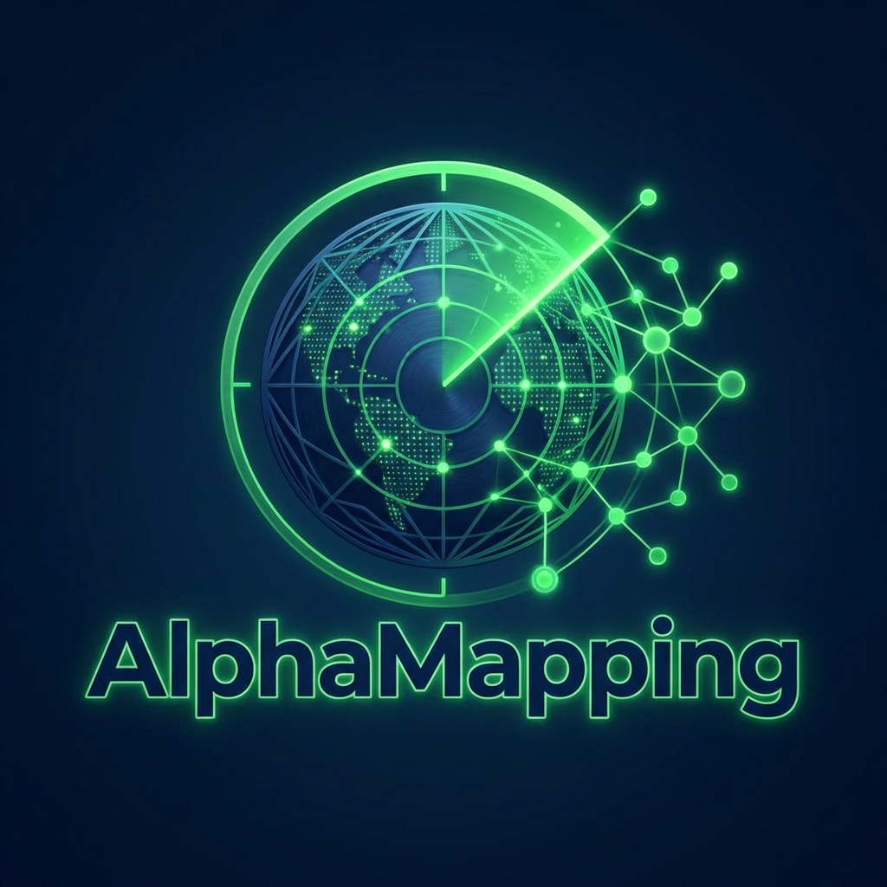
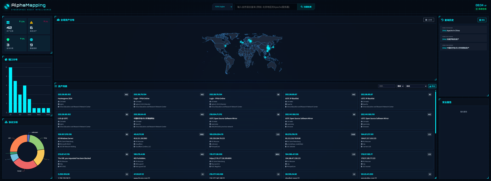

# AlphaMapping - 工业级网络空间资产态势感知平台

[](LICENSE)
[](https://www.python.org/downloads/)
[](docker-compose.yml)

中文 | [English](README.en.md)

<p align="center">
  
</p>

AlphaMapping 是一款下一代网络空间资产查询与智能分析系统。它将多平台资产测绘（FOFA, ZoomEye）与 AI 智能大模型（LLM）深度融合，提供自然语言交互、实时态势感知大屏及自动化的安全风险评估。

> 💡 **设计理念：站在巨人的肩膀上**
>
> AlphaMapping **不进行任何主动探测**，而是充分整合 FOFA、ZoomEye 等成熟网络空间测绘平台的数据能力。我们专注于：
> - 🔗 **数据聚合**：统一多平台数据接口，消除重复查询
> - 🧠 **智能分析**：利用 AI 大模型深度解读资产暴露风险
> - 📊 **可视化呈现**：将复杂数据转化为直观的态势感知大屏

> 📸 **界面预览**：沉浸式态势感知可视化大屏




## 🌟 核心特性

### 🖥️ 态势感知大屏
- **极客科幻风格**：Glassmorphism 深色大屏设计，专为 SOC 监控中心打造
- **实时数据可视化**：ECharts 动态图表 — 端口分布、协议分析、全球地理热力图
- **交互式联动**：点击图表即筛选资产列表，地图散点联动资产卡片高亮
- **5列网格布局**：资产卡片紧凑展示，一屏呈现更多信息

### 🤖 AI 智能引擎
- **NL2CSEQL 翻译**：自然语言 → 平台查询语法（如 "查找北京的 Apache 服务器"）
- **安全风险报告**：AI 自动分析资产暴露面，生成风险等级、漏洞关联、修复建议
- **单资产深度分析**：一键触发单个资产的 AI 安全研判

### 📡 多源数据融合
- **双平台支持**：FOFA + ZoomEye 开箱即用，可扩展更多数据源
- **智能缓存**：相同查询优先本地命中，节省 API 配额
- **数据去重**：IP:Port 唯一约束，自动 Upsert 更新

### 📊 数据管理
- **高级筛选**：关键词、国家、协议、端口多维度过滤
- **多格式导出**：CSV / Excel / JSON 一键下载
- **定时任务**：Cron 表达式配置，自动拉取资产更新

### 🐳 开箱即用
- **Docker 一键部署**：`docker-compose up -d` 即可启动
- **PowerShell 脚本**：Windows 环境自动化运维
- **OpenAPI 文档**：FastAPI 自动生成交互式 API 文档

---

## 🏗️ 技术架构

| 层级 | 技术栈 |
| --- | --- |
| **后端** | FastAPI, SQLAlchemy, Pydantic, OpenAI SDK, APScheduler |
| **前端** | Vanilla JS (ES6+), CSS3, ECharts 5 |
| **数据库** | SQLite (开发) / PostgreSQL (生产可选) |
| **部署** | Docker, docker-compose, Nginx, PowerShell |
| **测试** | pytest, pytest-cov, pytest-asyncio |

```
AlphaMapping/
├── backend/           # FastAPI 后端
│   ├── app/
│   │   ├── core/      # 配置、数据库
│   │   ├── models/    # ORM 模型
│   │   ├── services/  # 业务逻辑
│   │   └── main.py    # API 路由
│   └── tests/         # 单元测试
├── frontend/          # 静态前端
├── docker/            # 容器配置
└── scripts/           # 自动化脚本
```


## 🚀 快速开始

### 前置要求
- Python 3.8+
- Git

### 本地开发

```bash
# 1. 克隆项目
git clone https://github.com/your-repo/AlphaMapping.git
cd AlphaMapping

# 2. 配置 API 密钥
cp backend/.env.example backend/.env
# 编辑 backend/.env 填入 FOFA_KEY, ZOOMEYE_KEY, OPENAI_API_KEY

# 3. 启动服务
# Windows (PowerShell)
./scripts/run.ps1

# Linux / macOS
chmod +x scripts/*.sh
./scripts/run.sh

# 访问
# - 前端大屏: http://localhost:3000
# - API 文档: http://localhost:8000/docs

# 停止服务
# Windows: ./scripts/stop.ps1
# Linux/macOS: ./scripts/stop.sh
```

## 🐳 Docker 部署

使用 Docker Compose 一键部署：

```bash
# 配置环境变量
cp backend/.env.example .env
# 编辑 .env 填入 API 密钥

# 启动服务
docker-compose up -d

# 访问
# - 前端: http://localhost
# - API: http://localhost:8000
```

详细说明请参阅 [README.Docker.md](./README.Docker.md)

## 🧪 运行测试

```bash
cd backend
pip install -r requirements.txt
pytest tests/ -v --cov=app
```

## 📝 贡献指南

欢迎提交 Pull Requests 或 Issues！请先阅读 [CONTRIBUTING.md](CONTRIBUTING.md) 了解贡献流程。

本项目遵循 [Contributor Covenant 行为准则](CODE_OF_CONDUCT.md)。

## 🔒 安全

安全问题请参阅 [SECURITY.md](SECURITY.md)。

## 📄 许可证

本项目采用 MIT 许可证 - 详见 [LICENSE](LICENSE) 文件。

## 📋 更新日志

查看 [CHANGELOG.md](CHANGELOG.md) 了解版本变更历史。

---
*AlphaMapping - Mapping the Unknown in Cyberspace.*